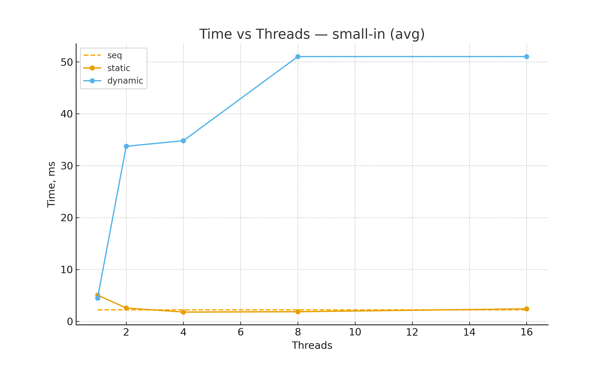
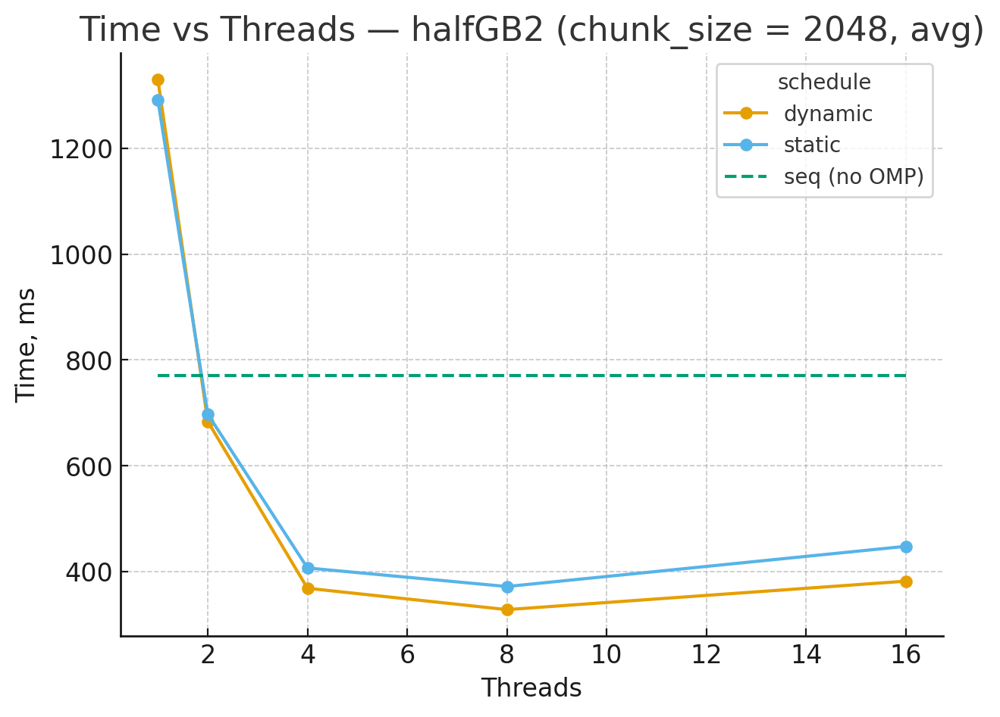
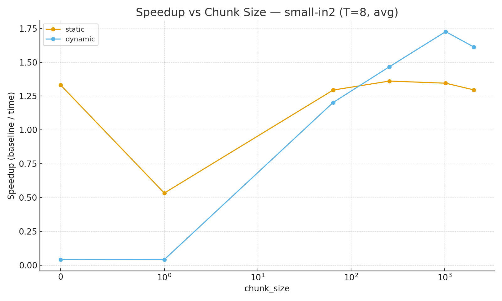
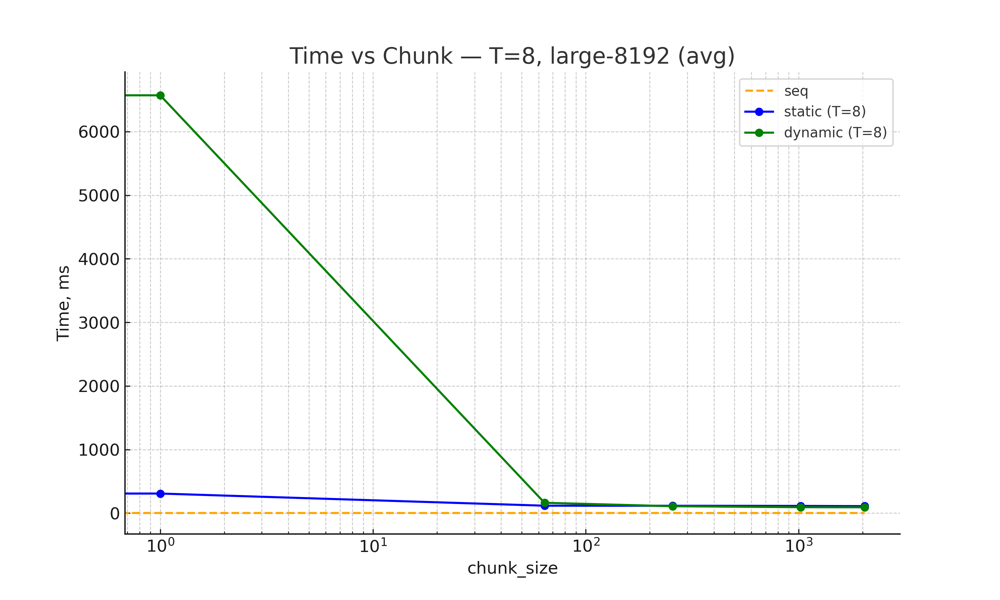

# Оптимизация по скорости (OpenMP).

## Краткое описание задачи
Данная программа предназначена для увеличения контрастности изображений, представленных в формате PGM (P5) и PPM (P6). Программа подсчитывает нижние и верхние границы для каждого из цветовых каналов одинаково --coef и растягивает гистограмму яркостей до диапазона [0, 255]. Результатом работы является обработанный файл, а так же вывод на консоль времени (в ms) и количества потоков, задействованных в работе. 

## Используемые конструкции OpenMP
В коде применяются:
1. `#pragma omp parallel` — директива OpenMP, которая создаёт группу потоков, в свою очередь они исполняют одно и то же тело блока кода, заключённого в {...}. Внутри того же блока кода существуют идентификаторы: `omp_get_num_threads()`, который считывает фактическое число потоков, а так же `omp_get_thread_num()`, который возвращает идентификатор конкретного потока.
2. `#pragma omp parallel for schedule(runtime)` — директива, которая задаёт распараллеливание циклов c выбранным планированием, которое берётся из `omp_set_schedule(...)` / `OMP_SCHEDULE`.
3. `omp_set_num_threads(N)` — команда для установки числа потоков согласно параметра `--omp-threads`.
4. `static` - тип планирования, благодаря которому кол-во итераций заранее равномерно распределяется между потоками, что добавляет минимальные дополнительные расходы, но может неэффективно работать, если нагрузка на потоки будет разной, тогда может быть ситуация, что один поток завершил работу и ничего не делает, пока другой продолжает работу.
5. `dynamic` - тип планирования, благодаря которому каждый поток получает новый чанк для обработки сразу, как только завершил обработку предыдущего. Такой подход позволяет лучше распределять неравномерную нагрузку по потокам, но требует на это больше дополнительных расходов.
6. `omp_set_schedule(kind, chunk)` / `OMP_SCHEDULE` директива / макрос для установки планирования (`static` / `dynamic`) и размера чанка. Если не были переданы через CLI, берётся базовое значение из `SCHEDULE_CHUNK_SIZE` либо переменной окружения.
7. `omp_get_wtime()` фунция, которая возвращает время в секундах, используется, чтобы посчитать временные затраты на работу алгоритма.

## Основная часть программы
### Шаги алгоритма
1. **Чтение файла** (происходит последовательно).
2. **Подсчёт гистограммы** для кажого канала:
   - Для RGB: объединённая гистограмма по сумме трёх гистограмм по каждому из каналов.
   - Игнорируя долю крайних пикселей (параметр --coef), находим пороги `lower[c]` и `higher[c]`.
3. **Линейное преобразование** каждого пикселя:

4. **Запись в файл** (происходит последовательно).

### Что распараллелено
- **Подсчёт гистограмм**: цикл по пикселям `for i in [0; N)` с локальными гистограммами на поток (`local[tid][channel][value]++`). Это позволяет избежать гонок данных (`data races`) и значительно, как показали тесты, ускоряет работу программы. После — последовательное слияние локальных гистограмм.
- **Преобразование пикселей (stretch)**: отдельный параллельный проход по пикселям с `schedule(runtime)`.

### Почему так
Оба этапа работы программы абсолютно параллельны. Локальные гистограммы исключают обращение разных потоков к одним и тем же переменным, что снижает время на обработку таких ситуаций, слияние гистограмм работает за — O(256·C·T), что мало относительно O(N).

## Параметры запуска
Основные флаги программы:
- `--no-omp` или `--omp-threads <N / default>`
- `--schedule <static / dynamic>` и `--chunk_size < >= 0>`
- `--coef <float in [0.0,0.5)>`

## Тестирование
Тестирование проводится для типов планирования **static** и **dynamic**, на **небольших** и **достаточно больших** изображениях. Все графики — в `assets/` и вставлены в отчёт.

### Основные этапы
1. Подготовить тестовые изображения P5 и P6 различных размеров.
2. Выполнить тестирование программы:
   - выполнить серию прогонов (последовательно и с OpenMP),
   - изменить число потоков `T in {1, 2, 4, 8, 16}`,
   - сравнить планирования `static` и `dynamic`,
   - изменить `chunk_size in {0, 1, 64, 256, 1024, 2048}`,
   - сравнить результаты.
3. Построить графики и загрузить их в директорию **assets**.
4. Проанализировать полученные данные.

### Набор графиков
- **Time vs Threads** тесты для `static` и `dynamic` для разных масштабов изображений:
  - 
  - 
- **Speedup vs Chunk Size** при числе потоков (T = 8):
  - 
- **Time vs Chunk Size** при числе потоков (T = 8):
  - 

## Анализ результатов
1. **Параллелизация vs последовательность**:
   - Последовательный подход лучше показывает себя на маленьких изображениях (в пределах сотен Mb), но может так же и проигрывать даже на незначительного размера файлах, что видно по первому графику.
   - Параллелизация может ухудшать резульат из-за дополнительных расходов на создание потоков и их управление, но при грамотном подборе аргументов достигаются результаты лучше, чем при обычном подходе.
   - При заданном числе потоков (T = 8) разные типы планирования показали себя практичесик эквивалентно на изображении 8192x8192 пикселя, но всё равно проиграли по времени последовательному подходу из-за накладных расходов на параллелизацию.
   - На втором графике видна чёткая разница с выигрышем параллельного подхода к задаче на больших изображениях.
2. **Static vs Dynamic**:
   - `static` обычно быстрее на однородных нагрузках.
   - `dynamic` выигрывает, если нагрузка неоднородна.
   В нашей задаче нагрузка на каждый из потоков одинакова, поэтому в большинстве случаев выигрывает именно тип планирования `static`.
3. **chunk_size**:
   - Слишком маленький чанк увеличивает накладные расходы, особенно при планировании `dynamic`, так как постоянно тратятся ресурсы на выделение нового чанка для потока.
   - Слишком крупный размер чанка может замедлить программу, ведь при небольшом размере изображении не всем потокам достанется работа, и ядра будут простаивать.
   Исходя из результатов тестов, лучшими вариантами для размера чанков (для 8 потоков) являются: 1024 и 2048.

## Выводы
- На маленьких изображениях подход без параллелизации показал себя гораздо лучше, так как не вызывает дополнительных расходов на создание потоков.
- На средних изображениях (порядка десятков Mb) распараллеливание проигрывает около десятка миллисекунд.
- На больших изображениях (порядка 0.5Gb) распараллеливание улучшает скорость работы программы примерно в 2 раза.
- Для данной задачи планировщик `static` показал себя в среднем лучше, но с грамотно подобранным количеством потоков и размером чанков выигрывает планировщик `dynamic`, хоть и незначительно.

## Примеры команд запуска
```bash
# Последовательно (без OpenMP) с коэффициентом 0.02
./lab0 --input in.pnm --output out.pnm --coef 0.02

# С OpenMP, 8 потоков, планирование static, chunk_size = 256, коэффициент 0.03
./lab0 --input in2.pnm --output out.pnm --omp-threads 8 --chunk_size 256 --coef 0.03

# С OpenMP, 8 потоков, планирование dynamic, chunk_size = 2048, коэффициент 0.12
./lab0 --input pretty.pnm --output out.pnm --omp-threads 8 --schedule dynamic --chunk_size 2048 --coef 0.12
```